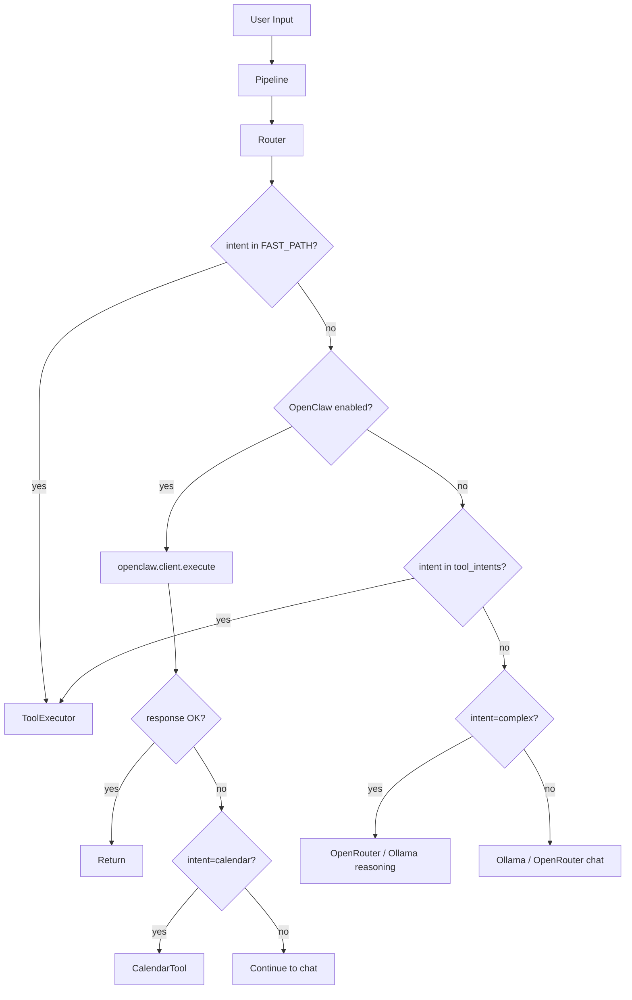

# Architecture — Gerty (Sprint 0)

> Snapshot of current architecture. Do not change runtime behavior until baseline is validated.

## Do Not Break Checklist

1. [ ] Local chat must still function
2. [ ] Voice must still function
3. [ ] Fast-path tools must still function
4. [ ] Chat UI must still function
5. [ ] OpenClaw disabled mode must still function
6. [ ] OpenClaw enabled but unavailable mode must still function
7. [ ] OpenClaw enabled and reachable mode must still function

---

## Request Flow (High Level)

```
User Input (chat / voice / Telegram)
         │
         ▼
   ┌─────────────┐
   │  Pipeline   │  custom_prompt, history trim, summarization (chat only)
   └──────┬──────┘
          │
          ▼
   ┌─────────────┐
   │   Router    │  classify_intent → route
   └──────┬──────┘
          │
          ├──► Fast-path? ──► ToolExecutor (time, alarm, timer, etc.)
          │
          ├──► OpenClaw enabled & not fast-path? ──► openclaw.client.execute
          │         │
          │         └──► Unavailable? ──► Calendar fallback OR continue to chat
          │
          ├──► Tool intent? ──► ToolExecutor (search, browse, screen_vision, etc.)
          │
          ├──► Complex? ──► OpenRouter or Ollama reasoning
          │
          └──► Default ──► Ollama or OpenRouter chat
```

---

## Request Flow (Mermaid)



---

## Key Modules

| Module | Responsibility |
|--------|----------------|
| `main.py` | Entry point. Builds ToolExecutor, Router, FastAPI app, PyWebView window. Starts server, Telegram, alarm loop, voice loop. |
| `pipeline.py` | Chat pipeline: load settings, apply custom prompt, trim/summarize history (chat only), add grounding/voice notes. Calls `router.route` or `router.route_stream`. |
| `llm/router.py` | Intent classification (`classify_intent`), routing to tools/Ollama/OpenRouter/OpenClaw. Contains routing policy inline. |
| `openclaw/client.py` | OpenClaw SDK wrapper. `execute()`, `execute_stream()`, `clear_session()`, `is_reachable()`. Formats message + history + system_context into single payload. |
| `ui/server.py` | FastAPI: `/api/chat`, `/api/chat/stream`, `/api/chat/history`, `/api/settings`, `/api/alarms`, `/api/timers`, `/api/notes`, `/api/rag/*`, `/api/voice/*`, static frontend. |
| `ui/bridge.py` | PyWebView JS bridge. `sendMessage`, `getHistory`, `startVoiceRecording`, `stopVoiceRecording`. Uses `chat_pipeline_sync`; keeps last 50 messages in memory. |
| `config.py` | Environment-based config. Ollama, OpenRouter, OpenClaw, voice, RAG, paths. |
| `settings.py` | Persistent user settings (provider, models, voice, RAG). Stored in `data/settings.json`. |
| `tools/*` | Tool implementations. Registered in `main.py` via `ToolExecutor.register()`. |

---

## Integration Points

| System | How Gerty Connects |
|--------|--------------------|
| **Ollama** | `OllamaClient` — HTTP to OLLAMA_BASE_URL. Chat, chat_stream, health. |
| **OpenRouter** | `OpenRouterClient` — HTTP to openrouter.ai. Chat, chat_stream, quick_search, research. |
| **OpenClaw** | `openclaw_sdk.OpenClawClient` — WebSocket to OPENCLAW_GATEWAY_WS_URL. `agent.execute()` or `execute_stream_typed()`. Port 18789 reachability check. |
| **Voice** | `voice/loop.py` — STT (faster_whisper/moonshine/vosk/groq), LLM via pipeline, TTS (piper/kokoro). Wake word or PTT. |
| **UI** | FastAPI + PyWebView. Frontend in `frontend/dist`. Bridge exposes `GertyAPI` to JS. |
| **Telegram** | `telegram/bot.py` — Uses `chat_pipeline_sync` with `_get_voice_history()` equivalent (fetches from `/api/chat/history`). |
| **Calendar** | `CalendarTool` runs `scripts/check_google_calendar.py`. Uses `openclaw/google_auth.py` for OAuth token (GOOGLE_TOKEN_PATH). |

---

## Data Flow: OpenClaw Payload

Current `_format_message()` in `openclaw/client.py`:

```
[System: {system_context}]

Previous conversation:
User: {msg1}
Assistant: {msg2}
...

{current_message}
```

- `system_context` = custom_prompt + OPENCLAW_TOOL_INSTRUCTIONS
- History passed as-is (no trimming in client)
- Single string sent to `agent.execute(message)` or `execute_stream_typed(payload)`

---

## Startup Sequence

1. Load `.env` from project root
2. Configure logging (GERTY_LOG_LEVEL)
3. Build ToolExecutor, register tools
4. Build Router with `executor.execute` as tool_executor
5. Register ScreenVisionTool (needs router for fallback)
6. Check Ollama reachability (warning only)
7. Start FastAPI server (port 8765) in background thread
8. Start Telegram bot if TELEGRAM_BOT_TOKEN set
9. Register timer/pomodoro callbacks, start alarm loop
10. Create PyWebView window, start voice loop
11. `webview.start()` blocks until window closed

---

## Assumptions

- Project root = parent of `gerty/` package
- `data/` directory for chat history, alarms, settings, RAG
- Frontend built to `frontend/dist` before serving
- OpenClaw daemon runs separately (`openclaw daemon start`)

---

## Files Inspected

- `gerty/main.py`
- `gerty/pipeline.py`
- `gerty/llm/router.py`
- `gerty/openclaw/client.py`
- `gerty/config.py`
- `gerty/settings.py`
- `gerty/ui/server.py`
- `gerty/ui/bridge.py`
- `gerty/tools/__init__.py`
- `gerty/tools/calendar_tool.py`
- `gerty/openclaw/google_auth.py`

---

## Uncertain / Not Yet Verified

- Exact frontend build process and whether it is required for UI to work
- Whether Telegram uses persisted history or in-memory only for context
- Voice loop: how it fetches history for OpenClaw requests (uses `_get_voice_history()` from `/api/chat/history`)
